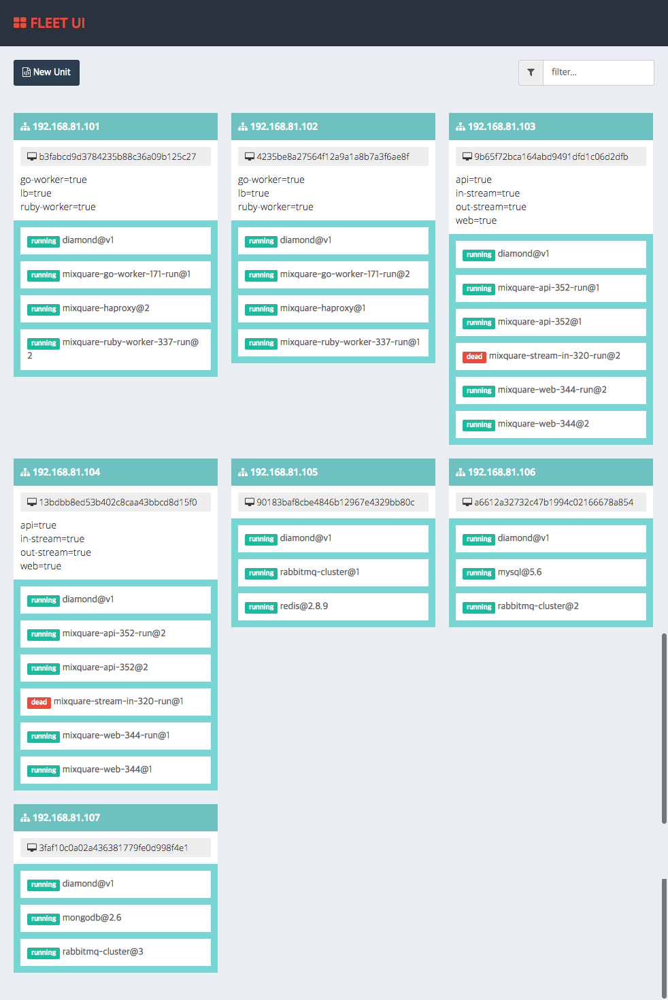

fleet-ui
========

Web based UI for [fleet](https://github.com/coreos/fleet)




## Getting started

(1) run docker container

- -e ETCD_PEER=`your_etcd_peer_ip`
- -p `port`:3000
- -v `your_ssh_private_key_file_path`:/root/id_rsa

```sh
docker run --rm -p 3000:3000 -e ETCD_PEER=10.0.0.1 -v ~/.ssh/id_rsa:/root/id_rsa purpleworks/fleet-ui
```

(2) enjoy!


## Usage

### docker build

```
$ cd angular
$ npm install
$ bower install
$ npm build
$ cd ..
$ docker build -t purpleworks/fleet-ui .
```

### run in local dev environment
run api server
```
$ go install
$ fleet-ui -etcd-peer=[your_etcd_peer_ip]
```
run web server

```
$ cd angular
$ npm install
$ bower install
$ grunt serve
```

## Prerequire

### Install Go

References:  
- https://golang.org/doc/install  
- https://golang.org/doc/code.html#Organization  

Check your environment:
```
$ go version
go version go1.3 darwin/amd64
```

```
$ echo $GOPATH
/Users/your_name/workspace/go
```


### Organize your workspace

clone your forked github repository to workspace($GOPATH)

```
$ mkdir $GOPATH/src/github.com
$ cd $GOPATH/src/github.com
$ git clone git@github.com:your_name/fleet-ui.git
```

here's an example:
```
bin/
pkg/
src/
    github.com/
        your_name/
          fleet-ui/
              .git/
              Dockerfile
              README.md
              app.go
              start.sh
```

## LINK

- [fleet-ui API list](https://github.com/purpleworks/fleet-ui/wiki)
- [coreos/fleet](https://github.com/coreos/fleet)
- [coreos-clustering document](https://coreos.com/using-coreos/clustering/)
- [fleet unit file](https://coreos.com/docs/launching-containers/launching/fleet-unit-files/)

## Contributing

1. Fork it ( https://github.com/purpleworks/fleet-ui/fork )
2. Create your feature branch (`git checkout -b my-new-feature`)
3. Commit your changes (`git commit -am 'Add some feature'`)
4. Push to the branch (`git push origin my-new-feature`)
5. Create a new Pull Request
